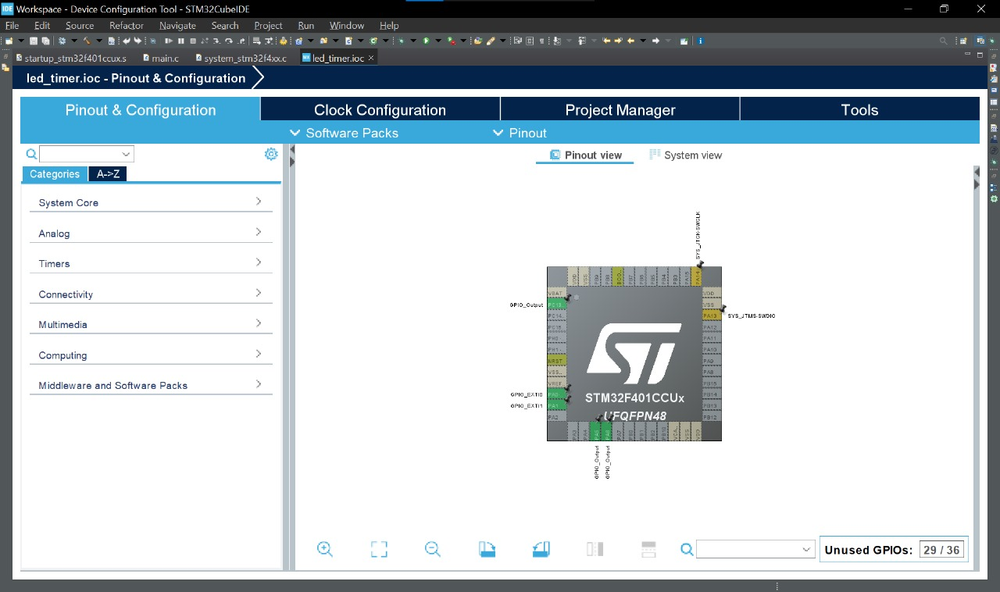
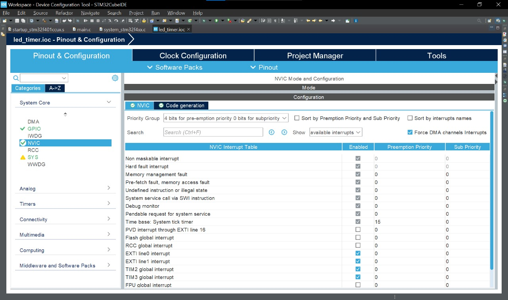

# LED Timer - STM32F401CCU6 Project

Proyek ini adalah implementasi **kontrol LED menggunakan timer interrupt** pada STM32F401CCU6. Program memungkinkan pengaturan kecepatan nyala LED melalui tombol eksternal, menggunakan `TIM2`, `TIM3` dan interrupt `EXTI0`, `EXTI1`.

Project dibuat menggunakan **STM32CubeIDE** dan menggunakan **HAL Library**.

---

## 📚 Daftar Isi

- [🧠 Fitur Utama](#-fitur-utama)
- [🔄 Tabel Pola LED](#-tabel-pola-led)
- [⚙️ Requirements](#️-requirements)
- [🖼️ Foto Rangkaian](#️-foto-rangkaian)
- [📍 Konfigurasi IOC](#-konfigurasi-ioc)
  - [🧷 Pin Mapping (IOC Screenshot)](#-pin-mapping-ioc-screenshot)
  - [⚙️ Konfigurasi GPIO](#️-konfigurasi-gpio)
  - [⏱️ Timer & NVIC Settings](#️-timer--nvic-settings)
- [🛠️ Cara Build dan Upload](#️-cara-build-dan-upload)
- [💾 Kode Penting](#-kode-penting)
- [📹 Demo Video](#-demo-video)
- [👥 Anggota](#-anggota)

---

## 🧠 Fitur Utama

- Tombol untuk mengubah kecepatan kedipan LED
- LED dikontrol oleh **TIM2 Interrupt** dan **TIM3 Interrupt**
- Terdapat 3 mode kecepatan
- Semua fungsi berjalan di **interrupt**, loop utama kosong
- Implementasi **debounce** sederhana menggunakan `HAL_GetTick()`

---

## 🔄 Tabel Pola LED

| Pola | Deskripsi     | PA5 (LED1) | PA6 (LED2) | PC13 (LED3 - onboard) |
| ---- | ------------- | ---------- | ---------- | --------------------- |
| 0    | LED Blinking  | 200ms      | 1000ms     | ON                    |
| 1    | LED Blinking  | 500ms      | 1500ms     | ON                    |
| 2    | LED2 Blinking | 1000ms     | 2000ms     | ON                    |

## ⚙️ Requirements

- STM32F401CCU6 + ST-Link V2
- STM32CubeIDE
- Kabel USB, LED, resistor, tombol push-button

---

## 🖼️ Foto Rangkaian


---

## 📍 Konfigurasi IOC

### 🧷 Pin Mapping (IOC Screenshot)



### ⚙️ Konfigurasi GPIO

- **PA0**: GPIO Input dengan interrupt (EXTI0), Pull-down
- **PA1**: GPIO Input dengan interrupt (EXTI1), Pull-down
- **PA5**: Output push-pull (LED)
- **PA6**: Output push-pull (LED)


### ⏱️ Timer & NVIC Settings

- **TIM2** diaktifkan dengan periode yang bisa diubah saat runtime
- **TIM3** diaktifkan dengan periode yang bisa diubah saat runtime
- **NVIC**: Aktifkan TIM2, TIM3 interrupt dan EXTI0, EXTI1




---

## 🛠️ Cara Build dan Upload

1. Buka file `led_timer.ioc` dengan **STM32CubeIDE**.
2. Build project.
3. Sambungkan STM32 ke komputer via ST-Link.
4. Klik **Run > Debug As > STM32 Cortex-M C/C++ Application**.
5. Tekan tombol untuk mengganti kecepatan nyala LED.

---

## 💾 Kode Penting

Berikut adalah bagian-bagian kode utama yang digunakan dalam proyek ini:

### 🔧 Variabel & Setup

```c
// Variabel privat
TIM_HandleTypeDef htim2;
TIM_HandleTypeDef htim3;

uint8_t led1_speed = 0;
uint8_t led2_speed = 0;
uint32_t last_press_time_pb0 = 0;
uint32_t last_press_time_pb1 = 0;
const uint32_t debounce_delay = 50;
const uint32_t led1_periods[] = {199, 499, 999};
const uint32_t led2_periods[] = {999, 1499, 1999};
```

### 🔁 Fungsi Update Timer

```c
void update_timer_period(TIM_HandleTypeDef *htim, uint32_t period)
{
  __HAL_TIM_DISABLE(htim);
  htim->Init.Period = period;
  HAL_TIM_Base_Init(htim);
  __HAL_TIM_SET_COUNTER(htim, 0);
  __HAL_TIM_ENABLE(htim);
}
```

### ⏱️ Callback Timer (Blink LED)

```c
void HAL_TIM_PeriodElapsedCallback(TIM_HandleTypeDef *htim)
{
  if(htim->Instance == TIM2)
  {
    HAL_GPIO_TogglePin(GPIOA, GPIO_PIN_5);
  }
  else if(htim->Instance == TIM3)
  {
    HAL_GPIO_TogglePin(GPIOA, GPIO_PIN_6);
  }
}
```

### 🛎️ Callback Tombol (EXTI)

```c
void HAL_GPIO_EXTI_Callback(uint16_t GPIO_Pin)
{
  uint32_t now = HAL_GetTick();

  if(GPIO_Pin == GPIO_PIN_0 && (now - last_press_time_pb0 > debounce_delay))
  {
    last_press_time_pb0 = now;
    led1_speed = (led1_speed + 1) % 3;
    update_timer_period(&htim2, led1_periods[led1_speed]);
  }
  else if(GPIO_Pin == GPIO_PIN_1 && (now - last_press_time_pb1 > debounce_delay))
  {
    last_press_time_pb1 = now;
    led2_speed = (led2_speed + 1) % 3;
    update_timer_period(&htim3, led2_periods[led2_speed]);
  }
}
```

### 🚀 Fungsi `main()`

```c
int main(void)
{
  HAL_Init();
  SystemClock_Config();
  MX_GPIO_Init();
  MX_TIM2_Init();
  MX_TIM3_Init();

  update_timer_period(&htim2, led1_periods[led1_speed]);
  update_timer_period(&htim3, led2_periods[led2_speed]);

  HAL_TIM_Base_Start_IT(&htim2);
  HAL_TIM_Base_Start_IT(&htim3);

  while (1)
  {
    // Loop utama kosong
  }
}
```

## 📹 Demo Video

Demo pola nyala LED di video berikut:
👉 [YouTube Demo: LED Variasi Interrupt STM32](https://youtu.be/g-Rb5NwO9XY)

## 👥 Anggota

1. Hayunitya Edadwi Pratita (23/518670/TK/57134)
2. Warda Saniia Fawahaana (23/518824/TK/57170)
